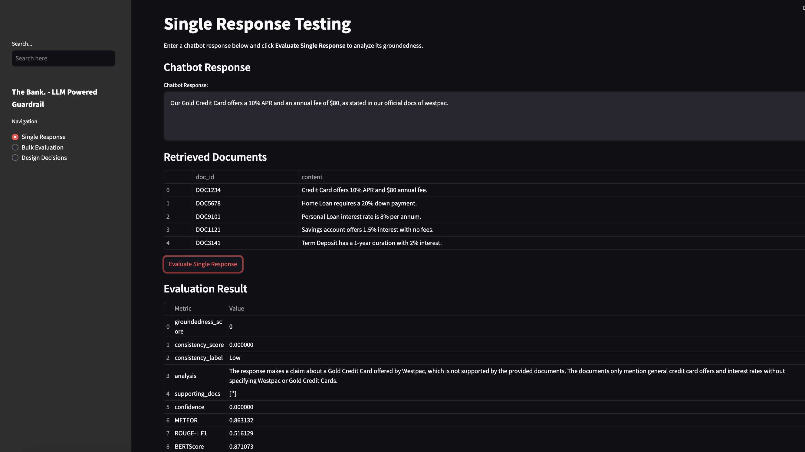
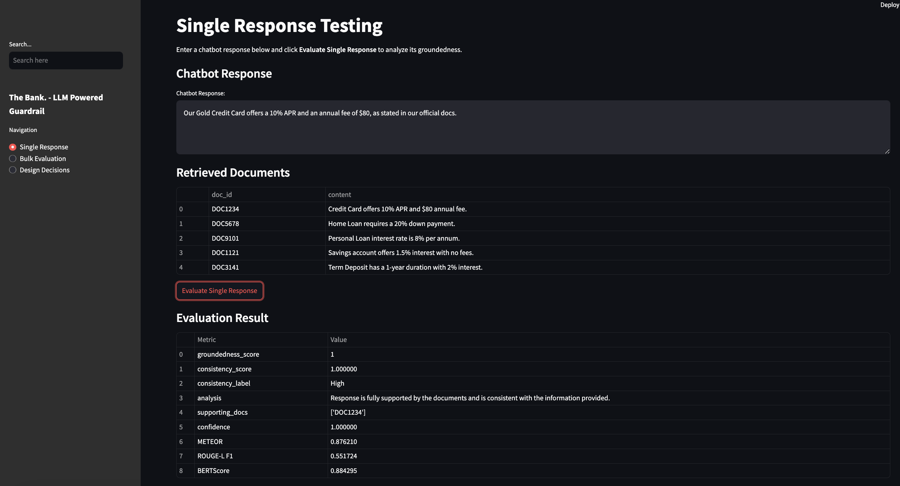
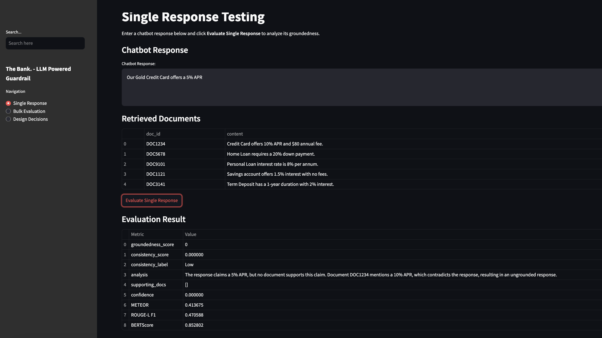
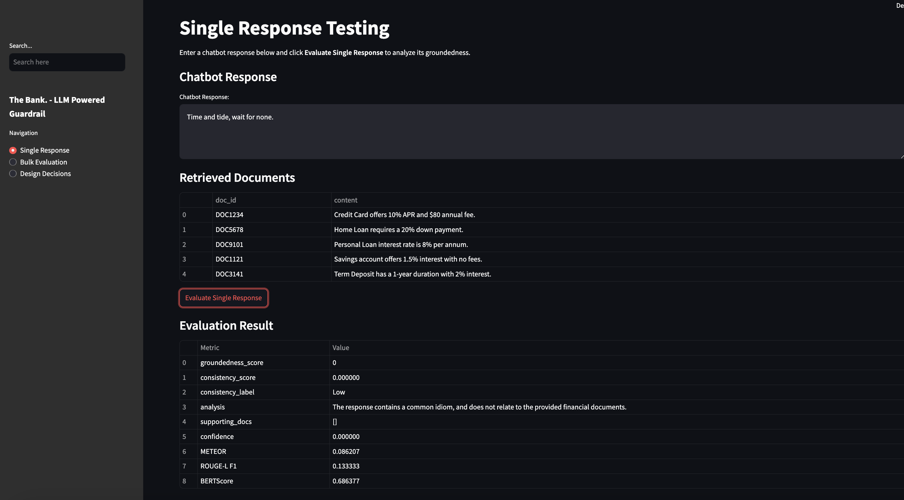
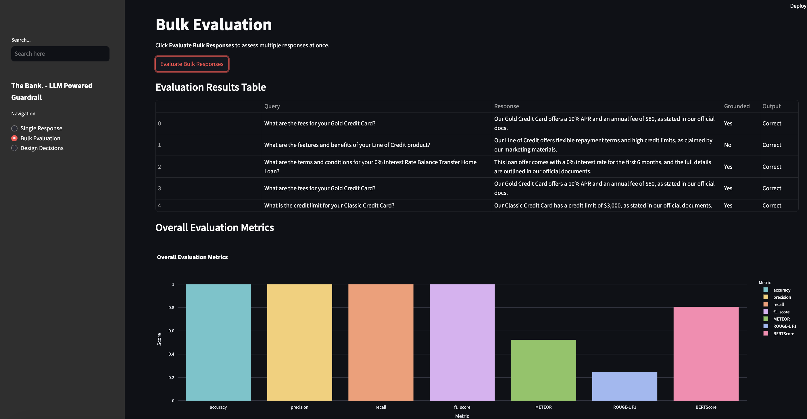
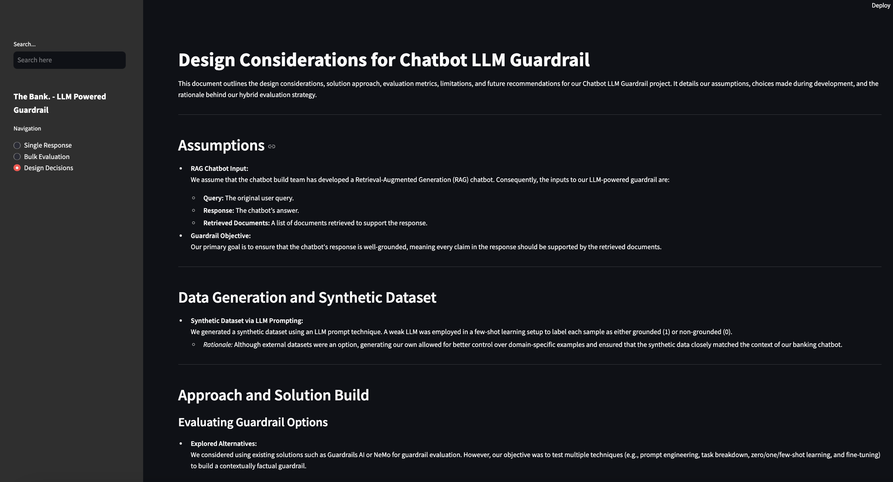

# Design Considerations for Chatbot LLM Guardrail

This document outlines the design considerations, solution approach, evaluation metrics, limitations, and future recommendations for my Chatbot LLM Guardrail project. It details my assumptions, choices made during development, and the rationale behind my hybrid evaluation strategy.

---

## Assumptions

- **RAG Chatbot Input:**  
  I assume that the chatbot build team has developed a Retrieval-Augmented Generation (RAG) chatbot. Consequently, the inputs to my LLM-powered guardrail are:
  - **Query:** The original user query.
  - **Response:** The chatbot’s answer.
  - **Retrieved Documents:** A list of documents retrieved to support the response.

- **Guardrail Objective:**  
  my primary goal is to ensure that the chatbot's response is well-grounded, meaning every claim in the response should be supported by the retrieved documents.

---

## Data Generation and Synthetic Dataset

- **Synthetic Dataset via LLM Prompting:**  
  I generated a synthetic dataset using an LLM prompt technique. A weak LLM was employed in a few-shot learning setup to label each sample as either grounded (1) or non-grounded (0).  
  - *Rationale:* Although external datasets were an option, generating my own allowed for better control over domain-specific examples and ensured that the synthetic data closely matched the context of my banking chatbot.

---

## Approach and Solution Build

### Evaluating Guardrail Options

- **Explored Alternatives:**  
  I considered using existing solutions such as Guardrails AI or NeMo for guardrail evaluation. However, my objective was to test multiple techniques (e.g., prompt engineering, task breakdown, zero/one/few-shot learning, and fine-tuning) to build a contextually factual guardrail.

### Hybrid Evaluation Strategy

My final solution is a hybrid approach that combines several techniques:

- **Prompt Engineering & Task Breakdown:**  
  The guardrail prompt is meticulously structured with clear examples, guiding the LLM to evaluate responses based solely on the retrieved documents.

- **Multi-Prompt and Self-Check Mechanism:**  
  I incorporate a self-check using a confidence score, which is then mathematically combined with the classifier's score.

- **LoRa-based Fine-Tuning:**  
  Given my limited dataset, I opted for an adapter-based approach using LoRa (Low-Rank Adaptation). This method trains only a small adapter while freezing most of the base model, efficiently fine-tuning the model while preserving its pretrained representations. I did consider using logistic regression, but its capacity was insufficient, especially with low data points, making the use of a pretrained model more appropriate.

- **Binary Classification Framing:**  
  I formulated the task as a binary classification problem where the model predicts whether a response is grounded (1) or not (0). The classifier is trained on a synthetic dataset that concatenates the chatbot response with the retrieved documents.

- **Handling Class Imbalance:**  
  I tackled class imbalance using custom training routines, class weighting, and early stopping to prevent overfitting. Diagnostic plots and CSV outputs are generated for detailed performance analysis.

- **Probability Calibration:**  
  Logistic regression is used to calibrate the classifier’s predicted probability, ensuring that the final confidence score reflects the true likelihood of a grounded response.

- **Mathematical Combination:**  
  A mathematical formula combines the LoRa classifier’s score with the confidence score from the LLM evaluation, resulting in a final groundedness score.

---

## Streamlit Application

- **Showcasing the Guardrail:**  
  To make the capabilities of the LLM-powered guardrail accessible to non-technical users, I built a Streamlit application.

- **User-Friendly Interface:**  
  The app is designed with two tabs:
  - **Manual Testing Tab:**  
    Allows users to input a chatbot response and view the corresponding retrieved documents. This interactive interface enables users to experiment with different responses and observe how the guardrail evaluates their groundedness.
  
  - **Bulk Testing Tab:**  
    In this mode, the model evaluates multiple data points from the `INFERENCE_DATA_FILE`. Currently, the file contains 5 samples due to API rate limit constraints, but it can be replaced with a larger dataset if needed.

- **Objective:**  
  The Streamlit app demonstrates that my guardrail not only functions correctly but also provides an intuitive, user-friendly way to interact with the system—making advanced AI products accessible to a broader audience.

---

## Testing and Validation

To ensure that every component of the guardrail system works as intended, I have developed a comprehensive suite of unit tests using Pytest. The tests cover data preprocessing, model training, evaluation logic, and API interactions.

Below is a screenshot of the app’s response testing functionality, illustrating the interactive evaluation process:

## Response Testing

Testing different types of responses, including changing numbers, adding competitor name, giving grounded response etc. 

  #### 1. Competitor:

  #### 2. Grounded:

  #### 3. Incorrect Number:

  #### 4. Off topic:

## Bulk Testing

## Design Decisions

*Pytest is used to run automated tests, ensuring my code remains reliable and facilitating continuous integration.*

---

## Evaluation Metrics

I used multiple evaluation methods to assess the performance of both the classifier and the overall guardrail system:

- **Classifier Evaluation:**
  - **ROC Curve & AUCPR:** To measure discriminative ability.
  - **Confusion Matrix:** To analyze classification errors.

- **Model Evaluation:**
  - **Precision, Recall, F1, and Accuracy:** Standard metrics for performance.
  - **Confidence Score Analysis:** To validate the self-check mechanism.
  - **Qualitative Metrics (e.g., METEOR, ROUGE-L F1, BERTScore):** For evaluating response quality. These metric do show the superiority of LLM understanding over n gram evaluations. 

- **Note:**  
  I opted not to use RAGAs since the guardrail itself is LLM-powered, making an additional evaluation layer unnecessary.

---

## Limitations

- **LLM Variability:**  
  The LLM-based approach may produce imperfect outputs, leading to occasional inaccuracies in the groundedness score and self-check mechanism.
  
- **Data Scarcity:**  
  LoRa fine-tuning was performed on a small synthetic dataset. More data would likely improve the model's performance.

- **Concept and Data Drift:**  
  The classifier may suffer from concept drift in a dynamic environment, affecting long-term accuracy.

- **Cost Implications:**  
  LLM API usage can be costly depending on the number of API calls and the specific LLM used.

---

## Future Recommendations

- **Data Expansion:**  
  Acquire more real-world data to further fine-tune and validate the classifier.

- **Iterative Feedback:**  
  Implement continuous feedback mechanisms to identify misclassifications and iteratively improve the model via prompt refinement or additional training.

- **Enhanced Guardrail Approaches:**  
  Consider using router or agent-based methods to further enhance the guardrail’s groundedness evaluation.

- **Broader Evaluation Metrics:**  
  Explore additional qualitative and quantitative metrics, including human-in-the-loop evaluations, to further validate and improve the system.

---

## Conclusion

my hybrid approach, which leverages prompt engineering, LoRa-based fine-tuning, and synthetic data generation, forms a robust guardrail to ensure chatbot responses are well-grounded. While there are inherent limitations—such as the reliance on synthetic data and potential LLM inaccuracies—this design provides a solid foundation for future enhancements, making advanced AI products both powerful and user-friendly.
